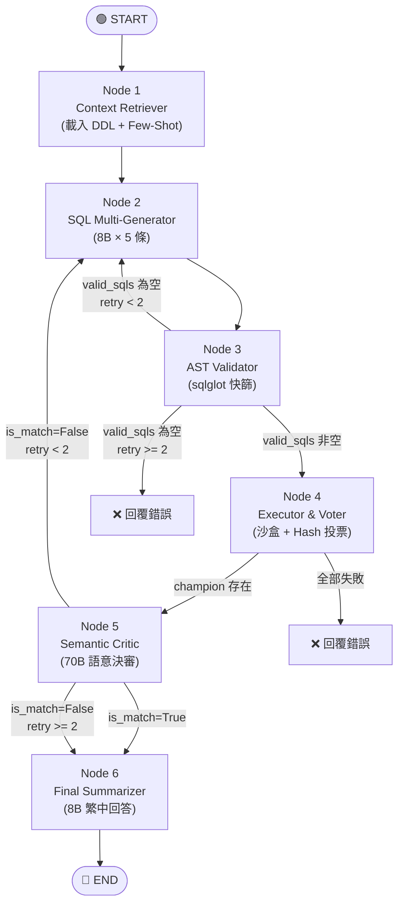

# LangGraph Funnel Pipeline Text-to-SQL 系統全實作（修正版 v2）

## 背景

將 **The Funnel Pipeline** 架構設計完整實作在 `D:\text_to_sql\langgraph_sql\` 目錄中。
此版本已根據使用者的 5 項關鍵修正建議進行調整。

## 修正摘要

| 項目            | 原始設計                                | 修正後                                                  |
| ------------- | ----------------------------------- | ---------------------------------------------------- |
| Node 0        | Regex 檢查 Prompt Injection + SQL 關鍵字 | **移除**。自用不需要，SQL 安全由 Node 3 AST 保障                   |
| Node 4 Hash   | 直接 Hash DataFrame                   | **排序後 Hash**。`sort_values + reset_index` 消除行順序差異     |
| Node 4 超時     | `SET STATEMENT max_statement_time`  | `SET SESSION max_execution_time = 5000`（MySQL 標準，毫秒） |
| Node 4 空集合    | `df.empty` 直接丟棄                     | **保留空集合參與投票**。只丟棄 DB Error 和 `len(df) > 500`         |
| Node 3 Column | 直接比對 Column Name                    | **建立 Alias → Table 映射**，fail-open 策略（無法解析則放行）        |
| Node 6 LLM    | 70B                                 | 降級為 **8B**，70B 專注 Node 5                             |

---

## Proposed Changes

### 目錄結構

```text
D:\text_to_sql\langgraph_sql\
├── __init__.py              # 套件初始化
├── config.py                # 設定檔（LLM 初始化、DB URI、常數）
├── state.py                 # AgentState 狀態定義
├── graph.py                 # LangGraph 圖定義與編排
├── main.py                  # CLI 互動進入點
│
├── nodes/                   # 所有 Node 實作
│   ├── __init__.py
│   ├── context_retriever.py # Node 1: Schema DDL + Few-Shot 載入
│   ├── sql_generator.py     # Node 2: SQL 多候選生成（N=5, 8B）
│   ├── ast_validator.py     # Node 3: AST 確定性快篩（sqlglot, MySQL 方言）
│   ├── executor_voter.py    # Node 4: 沙盒執行 + DataFrame 排序 Hash 投票
│   ├── semantic_critic.py   # Node 5: 語意決審（70B）
│   └── final_summarizer.py  # Node 6: 最終自然語言輸出（8B）
│
└── utils/                   # 共用工具
    ├── __init__.py
    ├── db_manager.py        # 資料庫管理器（超時控制、Read-Only 防護）
    └── schema_parser.py     # 從 semantic_layer.yaml 解析所有資訊
```

---

### Graph 流程圖



---

## 各 Node 實作細節

### [NEW] state.py — 狀態定義

```python
class AgentState(TypedDict):
    user_query: str               # 使用者原始問題
    schema_ddl: str               # DDL Schema
    enum_text: str                # Enum 欄位說明
    rules_text: str               # 商業邏輯規則
    few_shot_examples: str        # Few-Shot 範例
    candidate_sqls: list[str]     # N=5 候選 SQL
    valid_sqls: list[str]         # AST 通過的 SQL
    execution_results: dict       # {sql: json_result}
    champion_sql: str             # 投票勝出 SQL
    champion_result: str          # 勝出 SQL 的結果
    critic_feedback: str          # Critic 退回原因
    retry_count: int              # 重試計數（上限 2）
    final_answer: str             # 最終回答
    error_message: str            # 錯誤訊息
```

---

### [NEW] config.py — 設定

* `llm_fast`: `meta/llama-3.1-8b-instruct`, Temperature=0.6 → Node 2, 6
* `llm_strong`: `meta/llama-3.1-70b-instruct`, Temperature=0 → Node 5
* `MYSQL_URI`: 從 `.env` 讀取
* `MAX_CANDIDATES = 5`
* `MAX_RETRIES = 2`
* `SQL_TIMEOUT_MS = 5000`

---

### [NEW] nodes/context_retriever.py — Node 1

* 純確定性操作，不呼叫 LLM
* 從 `schema_parser` 載入 DDL、Enum、Rules、Few-Shot → 寫入 State

---

### [NEW] nodes/sql_generator.py — Node 2

* 使用 `llm_fast` (8B, T=0.6)
* Prompt 結構：System (DDL + Enum + Rules) → User (Few-Shot + Question + `critic_feedback`)
* 呼叫 5 次取得 5 條候選 SQL
* 解析輸出：移除 markdown 標記、提取純 SQL
* 若有 `critic_feedback`，將其注入 Prompt

---

### [NEW] nodes/ast_validator.py — Node 3（含 Alias 映射修正）

三層過濾 + 強制 LIMIT：

1. **語法檢查**：`sqlglot.parse_one(sql, read="mysql")`
2. **安全過濾**：Root Node 必須是 `SELECT`/`UNION`
3. **幻覺過濾**（fail-open 策略）：

   * 從 DDL 解析 `allowed_tables` 和 `table_columns` 映射
   * 遍歷 AST 中的 `Table` 節點，**建立 Alias → Table Name 映射**
   * 檢查 Table 是否存在於 Schema
   * 檢查帶有明確 Table 引用的 Column 是否存在（解析 Alias 後比對）
   * **無法確認的 Column（如聚合函數、計算欄位、無表引用）→ 放行**
4. **強制 LIMIT 注入**：若 SQL 沒有 LIMIT，用 AST 操作插入 `LIMIT 501`

---

### [NEW] nodes/executor_voter.py — Node 4（含排序 Hash 修正）

```python
# 核心 Hash 邏輯（修正版）
for sql in valid_sqls:
    try:
        df = db.execute_to_dataframe(sql, timeout_ms=5000)
        
        # ❌ 不再丟棄空集合！空集合也參與投票
        if len(df) > 500:
            continue  # 僅丟棄異常大量資料
        
        # ✅ 排序消除行順序差異
        df_sorted = df.sort_values(
            by=df.columns.tolist()
        ).reset_index(drop=True)
        
        result_hash = hashlib.md5(
            pd.util.hash_pandas_object(df_sorted).values
        ).hexdigest()
        
        # 投票...
    except Exception:
        continue  # DB Error 才丟棄
```

* 超時控制：`SET SESSION max_execution_time = 5000`（MySQL 標準，毫秒）
* Voting：找出最多票的 Hash，回傳對應的第一條 SQL

---

### [NEW] nodes/semantic_critic.py — Node 5

* 使用 `llm_strong` (70B, T=0)
* 單次呼叫完成：將 `champion_sql` + `user_query` 一起送入，請 LLM 判斷 SQL 語意是否與問題對齊
* 輸出 JSON：`{ "is_match": bool, "reason": str }`
* 路由：

  * `is_match=True` → Node 6
  * `is_match=False` 且 `retry_count < 2` → 回 Node 2，`retry_count += 1`
  * `is_match=False` 且 `retry_count >= 2` → 強制進 Node 6

---

### [NEW] nodes/final_summarizer.py — Node 6

* 使用 `llm_fast` (8B, T=0)（降級，節省 70B 算力）
* 將 `champion_result` (JSON) 翻譯為繁體中文友善回答
* 禁止輸出原始 SQL

---

## Verification Plan

### Automated Tests

```bash
# 安裝新套件
pip install sqlglot pandas

# 確認 import
python -c "import sqlglot; import pandas; print('OK')"
```

### Manual Verification

* 啟動：

```bash
python -m langgraph_sql.main
```

* 用 3 個問題測試：

  1. 「目前資料庫裡面總共有幾位客戶？」（單表）
  2. 「在所有已出貨的訂單中，哪個商品分類銷售數量最高？」（多表 JOIN）
  3. 「計算所有訂單的平均消費金額，再找出高於平均的最大筆訂單」（子查詢）

* 觀察 Log 確認完整 Pipeline 流程

---
